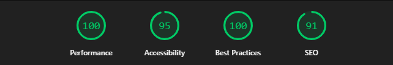
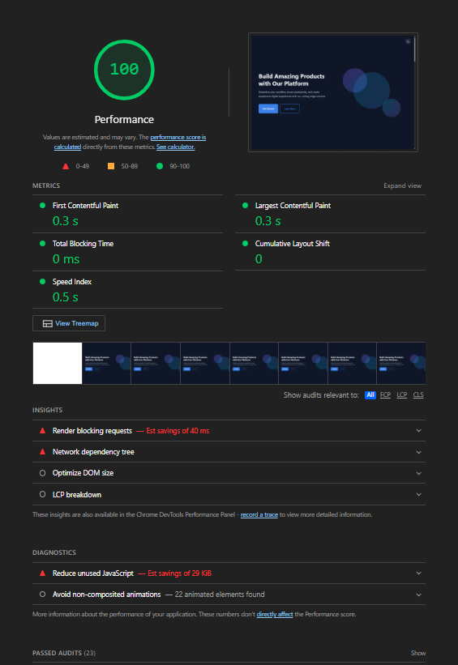
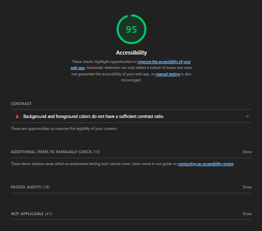
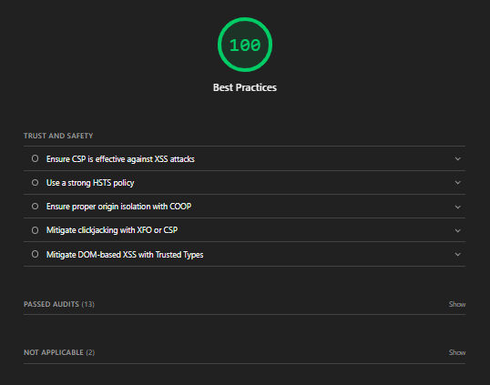
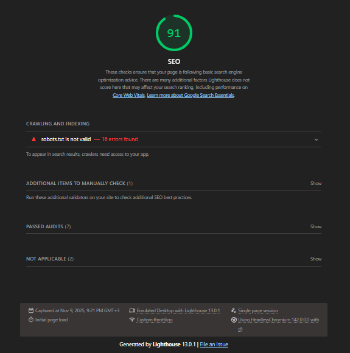

# Live Demo

[https://landinglab-dhktu86px-damlas-projects-64fa04a2.vercel.app](https://landinglab-dhktu86px-damlas-projects-64fa04a2.vercel.app)

# Product Landing Page

A modern, responsive landing page built with React, TypeScript, and SCSS. Features a complete UI component library and follows best practices for accessibility and performance.

## Features

- Semantic HTML5 structure
- Modern CSS with SCSS (BEM methodology)
- Responsive design (mobile-first, 320px-1440px)
- Light/Dark theme toggle with CSS variables
- Form validation (email format, empty field checks)
- Fully accessible (ARIA attributes, keyboard navigation)
- Reusable UI component library
- No external UI libraries

## Tech Stack

- **Framework**: React 19 + TypeScript
- **Build Tool**: Vite 7
- **Styling**: SCSS with BEM naming convention
- **Code Quality**: ESLint + Prettier
- **Version Control**: Git

## Prerequisites

- Node.js (v18 or higher)
- npm or yarn

## Installation

```bash
# Clone the repository
git clone <repository-url>
cd landing-page

# Install dependencies
npm install
```

## Available Scripts

```bash
# Start development server
npm run dev

# Build for production
npm run build

# Preview production build
npm run preview

# Run ESLint
npm run lint

# Fix ESLint errors
npm run lint:fix

# Format code with Prettier
npm run format

# Check code formatting
npm run format:check
```

## Project Structure

```
landing-page/
├── src/
│   ├── components/           # Reusable UI components
│   │   ├── Accordion/        # FAQ accordion component
│   │   ├── Button/           # Button component
│   │   ├── Card/             # Card component
│   │   ├── Input/            # Form input component
│   │   ├── Modal/            # Modal dialog component
│   │   └── ThemeToggle/      # Light/dark theme toggle
│   ├── sections/             # Landing page sections
│   │   ├── Contact/          # Contact form section
│   │   ├── FAQ/              # FAQ section
│   │   ├── Features/         # Features showcase
│   │   ├── Hero/             # Hero banner
│   │   └── Pricing/          # Pricing cards
│   ├── styles/               # Global styles
│   │   ├── _variables.scss   # CSS variables
│   │   ├── _mixins.scss      # SCSS mixins
│   │   └── global.scss       # Global styles
│   ├── App.tsx               # Main app component
│   └── main.tsx              # App entry point
├── docs/                     # Architecture documentation
├── .gitignore
├── .prettierrc
├── eslint.config.js
├── package.json
├── tsconfig.json
└── vite.config.ts
```

## Component Library

### Button
Customizable button with multiple variants and sizes.

**Props**: `variant`, `size`, `fullWidth`, `disabled`, `onClick`

### Input
Form input with validation and error display.

**Props**: `type`, `label`, `value`, `onChange`, `error`, `required`

### Card
Flexible card container with header, body, and footer sections.

**Props**: `variant`, `padding`, `hoverable`, `onClick`

### Modal
Accessible modal dialog with backdrop and close functionality.

**Props**: `isOpen`, `onClose`, `title`, `size`, `closeOnBackdrop`

### Accordion
Collapsible content sections for FAQ.

**Props**: `items`, `allowMultiple`, `defaultOpenItems`

## Responsive Breakpoints

- **Mobile**: ≤640px
- **Tablet**: 641px - 1024px
- **Desktop**: ≥1025px

## Theme System

The application supports light and dark themes using CSS variables. The theme preference is persisted in localStorage and respects the user's system preference.

Toggle between themes using the floating button in the top-right corner.

## Form Validation

The contact form includes:
- Email format validation (regex pattern)
- Required field validation
- Minimum length validation for message
- Real-time error display
- Accessible error messages (aria-invalid, aria-describedby)

## Accessibility Features

- Semantic HTML structure
- ARIA attributes (aria-label, aria-expanded, aria-hidden, etc.)
- Keyboard navigation support
- Focus management (focus trapping in modals)
- Screen reader friendly
- Sufficient color contrast
- Focus visible indicators

## Architecture Decisions

See the `docs/` folder for detailed architecture decision records:
- [ADR 001: Technology Stack](./docs/adr-001-technology-stack.md)
- [ADR 002: Styling Approach](./docs/adr-002-styling-approach.md)
- [ADR 003: Component Architecture](./docs/adr-003-component-architecture.md)

Key decisions:
- **React + TypeScript**: Type safety and modern React features
- **Vite**: Fast development and optimized builds
- **SCSS with BEM**: Maintainable and scalable styling
- **No UI libraries**: Custom components for full control
- **CSS Variables**: Dynamic theming support
- **Mobile-first**: Progressive enhancement approach

## Performance Optimizations

- Optimized images
- Code splitting
- CSS minification
- Tree shaking
- Lazy loading for modal content
- Efficient re-renders with React

## Lighthouse Performance Report

The project achieves excellent Lighthouse scores, exceeding the minimum requirement of 90/100:



### Detailed Scores

| Category | Score | Status |
|----------|-------|--------|
| **Performance** | 100/100 | ✅ Excellent |
| **Accessibility** | 95/100 | ✅ Excellent |
| **Best Practices** | 100/100 | ✅ Excellent |
| **SEO** | 91/100 | ✅ Excellent |

### Score Breakdown

<details>
<summary>Performance (100/100)</summary>



- First Contentful Paint: Excellent
- Largest Contentful Paint: Excellent
- Total Blocking Time: Excellent
- Cumulative Layout Shift: Excellent
- Speed Index: Excellent
</details>

<details>
<summary>Accessibility (95/100)</summary>



- ARIA attributes properly used
- Semantic HTML structure
- Keyboard navigation support
- Sufficient color contrast
- Screen reader friendly
</details>

<details>
<summary>Best Practices (100/100)</summary>



- No browser errors
- HTTPS ready
- No deprecated APIs
- Optimized images
- Valid source maps
</details>

<details>
<summary>SEO (91/100)</summary>



- Valid meta tags
- Crawlable links
- Mobile-friendly viewport
- Descriptive page title
- Valid structured data
</details>

**Full Reports**: Detailed HTML reports are available in the project root:
- [Desktop Performance Report](./lighthouse-desktop.html)
- [Mobile Performance Report](./lighthouse-mobile.html)

## Version History

For a detailed log of all changes, new features, and bug fixes, please refer to the [CHANGELOG.md](./CHANGELOG.md) file located at the project root.

## License Information

This project is open-sourced under the MIT License. The full text of the license can be found in the [LICENSE](./LICENSE) file at the project root.

## Browser Support

- Chrome (latest)
- Firefox (latest)
- Safari (latest)
- Edge (latest)

## Deployment

The project can be deployed to:
- **Vercel**: `vercel deploy`
- **Netlify**: Connect repository or drag & drop `dist` folder

## License

MIT

## Contact

For questions or support, please use the contact form on the landing page.